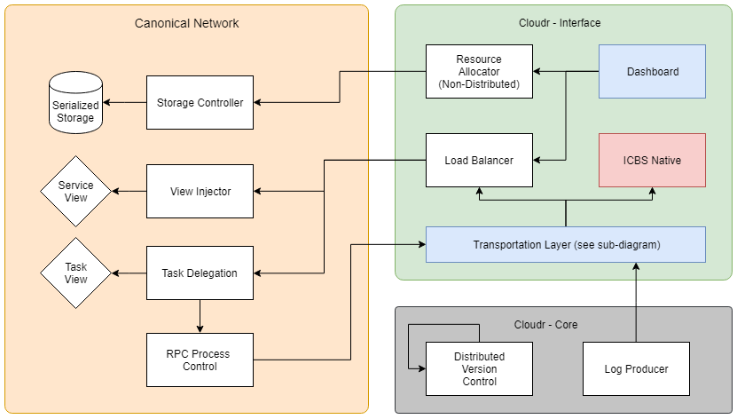
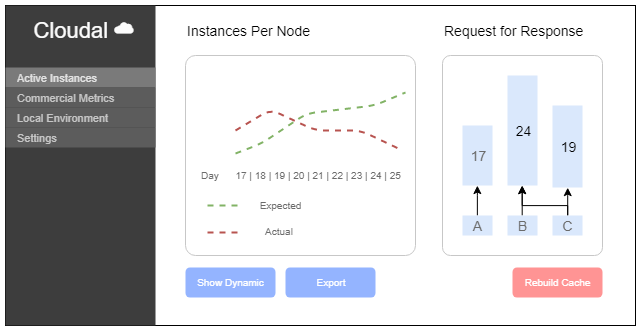

# Cloudal ☁
Cloudal is a RaaS (Repo as a Service) for distributed, high load, infrastructure. Cloudal treats microservices as a first class citizen via reverse proxy. Cloudal is inspired by [depress.io](https://github.com/minkcv/depress.io).

Use Cloudal if you need
- Modularity and Extensibility
- Native hashing and sockets
- CLI, REST API, and SSL
- Network health monitoring

## Cloudal 2 Layer Model



## Comprehensive Analytics
The Analytical Dashboard is available at `:0801` on re-emergent systems.



## Sourcing a distribution
Distributions are available as Grunt buildpacks, Vagrant images, and Docker containers.

Installing a buildpack

    $ make test run :dev --integrated

Swarm or Kubernetes

    $ docker run -d -p 8080:8081 -p 80:81 -v /etc/var/Cloudal

## Documentation and Configuration
[]()

The `docs` folder contains comprehensive documentation on the following topics
- Quickstart guide
- Serverless deployment
- v3 Migration Guide
- Event data modeling
- Metagem providers

### Config file
Configuration files take the form of Non-Binary Trees where a priority tree describes the traversal orders of other disjoint trees.

```
{
    "priority":
    [
        "production", "qa", "development"
    ],
    "production":
    [
        "port": 500,
        "domain": local
    ],
    "development":
    [
        "port": 0801,
        "domain": remote
    ],
    "qa":
    [
        "port": $PORT,
        "domain": $DOMAIN
    ]
}
```

## License
Permission is hereby granted to chuckle if you realized that this is all made up nonsense. If you haven't figured it out yet, this is just a joke/satire repo about cloud technologies.

THE SOFTWARE "OR LACK THERE OF" IS PROVIDED WITHOUT ANY ACTUAL VALUE EXPRESSED OR IMPLIED, INCLUDING BUT NOT LIMITED TO ACTUALLY GETTING WORK DONE OR NONINFRINGEMENT. TIME ENJOYED IS NOT TIME WASTED. THIS NOTICE TO BE INCLUDED IN ALL GIFT BASKETS AT THE TIME OF PURCHASE.
